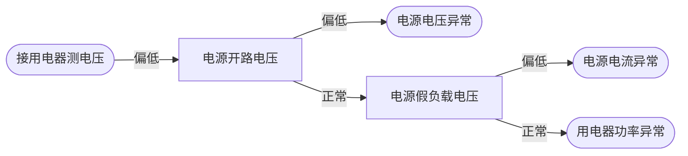

# 电阻器

电阻器 (R)：在电路中起阻碍电流大小的一种导体。

## 电阻类型

- 固定电阻器
  - 金属膜电阻器：热稳定性好，误差小。
  - 碳膜电阻器：热稳定性差，误差大。
  - 线绕电阻器：电阻值小，额定功率大。
  - 水泥电阻器：电阻值小，额定功率大。

- 可变电阻器（电位器）

## 贴片电阻

- 三位数：前两位是有效数字，最后一位是零的个数。误差默认 ±5%（无字母时）
- 四位数：前三位是有效数字，最后一位是 零的个数。误差默认 ±1%（无字母时）
- 0 欧姆保险电阻：表示为一个 0 或者 000
- 带 k 的电阻，K 代表单位 $2K2 = 2.2\mathrm{k}\Omega$
- 带 R 的电阻，R 代表小数点 $R39 = 0.39\Omega$
- 带字母的编码：部分电阻会在数字后加字母，直接标注误差，常见对应关系如下：
  - F：±1%
  - J：±5%
  - K：±10%
  - M：±20%

## 色环电阻

- 四位数：前两位是有效数字，第三位是零的个数，第四位是误差（通常为金色（10%）和银色（5%））。
- 五位数：前三位是有效数字，第四位是零的个数，第五位是误差（通常为棕色（1%））。
- 色环电阻的核心口诀是“棕红橙黄绿蓝紫灰白黑，金五银十无色二”，前者对应数字 0-9，后者对应误差百分比。

| 颜色 | 对应数字 | 倍率（四环电阻第三环/五环第四环） | 误差（四环第四环/五环第五环） |
| ---- | -------- | --------------------------------- | ----------------------------- |
| 黑色 | 0        | ×10⁰（即×1）                      | -                             |
| 棕色 | 1        | ×10¹（即×10）                     | ±1%                           |
| 红色 | 2        | ×10²（即×100）                    | ±2%                           |
| 橙色 | 3        | ×10³（即×1k）                     | -                             |
| 黄色 | 4        | ×10⁴（即×10k）                    | -                             |
| 绿色 | 5        | ×10⁵（即×100k）                   | ±0.5%                         |
| 蓝色 | 6        | ×10⁶（即×1M）                     | ±0.25%                        |
| 紫色 | 7        | ×10⁷（即×10M）                    | ±0.1%                         |
| 灰色 | 8        | ×10⁸（即×100M）                   | -                             |
| 白色 | 9        | ×10⁹（即×1G）/×10⁻¹（即×0.1）     | -                             |
| 金色 | -        | ×10⁻¹（即×0.1）                   | ±5%（口诀“金五”）             |
| 银色 | -        | ×10⁻²（即×0.01）                  | ±10%（口诀“银十”）            |
| 无色 | -        | -                                 | ±20%（口诀“无色二”）          |

- 特殊情况：金色和银色在 0 的个数这一环上代表小数点前移。（金色 0.1，银色 0.01）

## 电阻器的应用

### 串联分压

在 **直流** 电路中，串联分压

- $U=U_1+U_2$
- $R=R_1+R_2$
- $I=I_1=I_2$

### 并联分流

在 **交、直流**电路中，并联分流

- $U=U_1=U_2$
- $R=\frac{1}{\frac{1}{R_1}+\frac{1}{R_2}}$
- $I=I_1+I_2$
- $P=P_1+P_2$

## 电阻的一般故障

开路（断路）或电阻阻值增大

## 实战

场景：电源适配器连接的用电器，用电器异常。

### 测量流程

### 解析

**原因 1**：电源电压异常

**原因 2**：电源电流异常

**原因 3**：用电器功率异常增大（短路、漏电）

电源不是理想电源（比如家里的插座、电池、充电器等实际电源），如果是理想电源，电压不会变。

简单说原理：实际电源自身有内阻，电流流过内阻时会损耗电压。

1. 负载功率增大（比如给手机充电时，又插上一个平板电脑，总负载功率就变大）；
2. 在电压基本稳定的前提下，功率变大必然导致电流增大（公式：功率=电压×电流）；
3. 电流增大后，电源内阻上损耗的电压变多，最终输出到负载上的电压就会略微变小。
