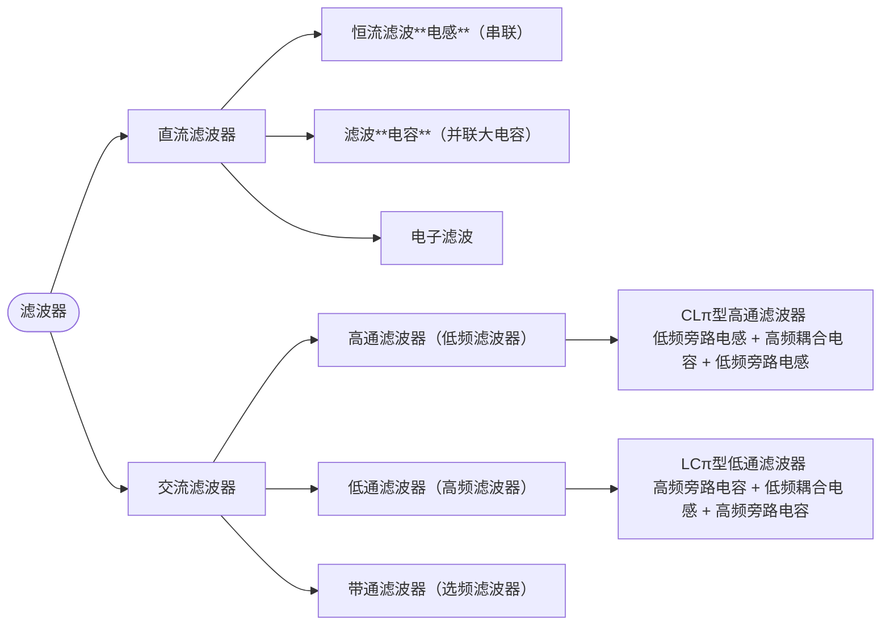
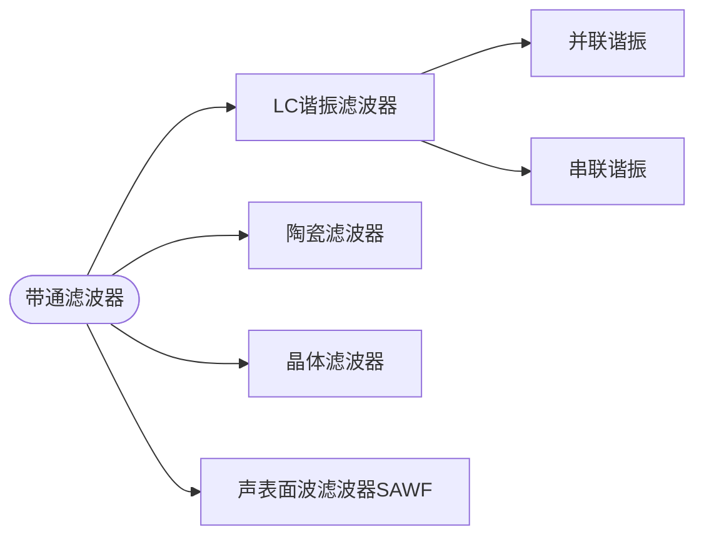

# 滤波器

## 概论

## 带通滤波器

## LC 谐振电路

串联或并联的 **电容 + 电感** 形成的一个整体电路。

- 无论串联还是并联，让感抗 ($X_L$) 等于 容抗 ($X_C$) 的那个频率就是谐振频率。
- 核心：电流增大时电容器放电
- 周期：$f_0 = \frac{1}{2\pi\sqrt{LC}}$
- 能量转化：
  - 电流增大时：磁场能增大，电场能减小
  - 电流减小时：磁场能减小，电场能增大

| 特性                | 串联 LC 谐振                      | 并联 LC 谐振                      |
| :------------------ | :-------------------------------- | :-------------------------------- |
| **阻抗 (Z)**        | **最小** ($Z = R$)                | **最大** ($Z \approx \infty$)     |
| **电流 (I)**        | **最大**                          | **最小**                          |
| **功能形象**        | **“通频带”**（允许特定频率通过）  | **“陷波器/选频”**（阻挡特定频率） |
| **电压关系**        | 电感/电容电压相互抵消（外部表现） | 电感/电容电流相互抵消（外部表现） |
| **相位差 ($\phi$)** | 电压电流同相 (纯电阻性)           | 电压电流同相 (纯电阻性)           |
| **绰号**            | 电压谐振                          | 电流谐振                          |
