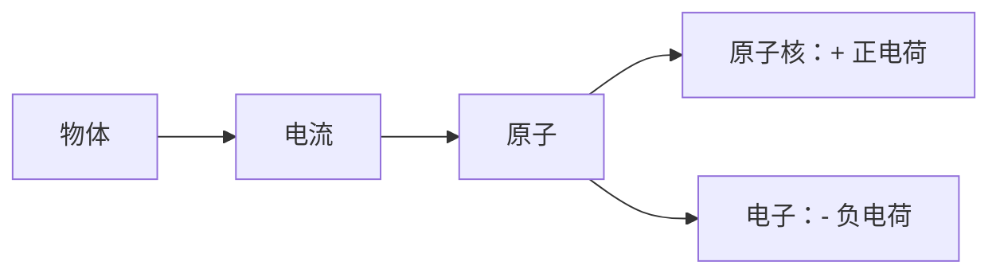

# 电流

电流（I）：电子的定向移动形成电流

电路：由导体、电源、导线、控制器构成的 **闭合回路**。

从原子角度看，物质是 **绝缘体** 还是 **导体** ，核心区别在于原子核对最外层电子的束缚能力以及由此产生的自由电子数量。

电流方向是人规定、与电子的运动方向恰恰相反。

电流强度的单位：**安培（A）**

- $1 \text{A} \approx 6.25 \times 10^{18} \text{ 个电子 / 秒}$
- $1 \text{A(安)} = 10^3 \text{mA（毫安）} = 10^6 \text{uA（微安）}$
  
电路的 **做功** 就是消耗电子，**功率（P）** 的大小由消耗的电子多少决定，消耗的电子多少由 **负载** 决定。

我们在替换电池的时候，在电压相等的前提下，电量不能比原电池低。
