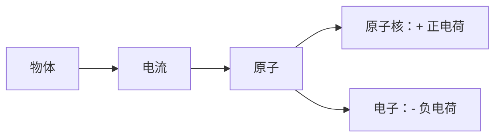
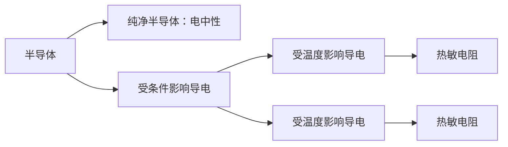

# 电流

- 电流：电子的定向移动形成电流
- 符号：I

## 形成电流的条件

电路 —— 由导体、电源、导线、控制器构成的闭合回路。

```mermaid
flowchart LR
物体 --> 电流 --> 原子 --> A[原子核：+ 正电荷] & B[电子：- 负电荷]
```

导体：有自由电子的物体 (-) > (+)

绝缘体：电中性物体 (-) = (+)

```mermaid
flowchart LR
半导体 --> A[纯净半导体：电中性] & B[受条件影响导电]
B --> C[受温度影响导电] --> D[热敏电阻]
B --> E[受温度影响导电] --> F[热敏电阻]
```

- 电流方向是人规定、与电子的运动方向恰恰相反。
- 电流强度的单位：安培（A）。$1A=10^3mA=10^6uA$
