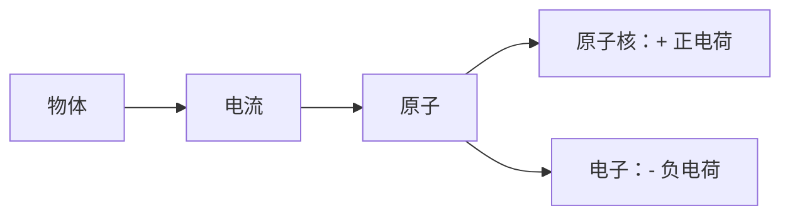

# 电流、电压、电阻

## 电流

电流（I）：电子的定向移动形成电流

电路：由导体、电源、导线、控制器构成的 **闭合回路**。

从原子角度看，物质是 **绝缘体** 还是 **导体** ，核心区别在于原子核对最外层电子的束缚能力以及由此产生的自由电子数量。

电流方向是人规定、与电子的运动方向恰恰相反。

电流强度的单位：**安培（A）**

- $1 \text{A} \approx 6.25 \times 10^{18} \text{ 个电子 / 秒}$
- $1 \text{A（安）} = 10^{3} \text{mA（毫安）} = 10^{6} \text{uA（微安）}$
  
电路的 **做功** 就是消耗电子，**功率（P）** 的大小由消耗的电子多少决定，消耗的电子多少由 **负载** 决定。

我们在替换电池的时候，在电压相等的前提下，电量不能比原电池低。

## 电压

电位（U）：也称为电势。是电场中某点相对零电势点的电势数值，是相对量。

电压（U）：电流流过导体后，在其两端形成的电势差（电位差）

地线（GND,VSS）：电位被规定为 0V（零电势点）的某一根闭合回路线。

**注意** ：电路图中的「地线」和 电力系统中的「地线」不一样

| 对比维度   | 电路图中的“地线”               | 市电中的“地线”       |
| ---------- | ------------------------------ | -------------------- |
| 本质       | 抽象的零电势参考点（人为规定） | 与大地相连的物理导线 |
| 是否接大地 | 不一定（多数情况下不接）       | 必须接大地           |
| 功能       | 方便分析电位关系               | 安全保护、稳定电位   |
| 符号意义   | 表示“0V 参考”                  | 表示“与大地连通”     |

电压的单位：**伏特 V**

- $1 \text{KV（千伏）} = 10^{3} \text{V（伏）} = 10^{6} \text{uV（豪伏）}= 10^{9} \text{uV（微伏）}$

## 电阻

电阻（R）：在电路中起阻碍电流大小的一种物理量。

电阻量的决定因素：材料、横截面、长度。

$R电阻 = ρ电阻率 \frac{L 长度}{S 面积}$

电阻的单位：**欧姆**

- $1 \text{MΩ（兆欧）} = 10^3 \text{KΩ（千欧）} = 10^6 \text{Ω（欧）}$

电流、电压、电阻的关系是 **欧姆定律**。$I电流 = \frac{U 电压}{R 电阻}$

电流、电压、功率的关系是 $P \text{功率} = U \text{电压} \times I \text{电流}$
