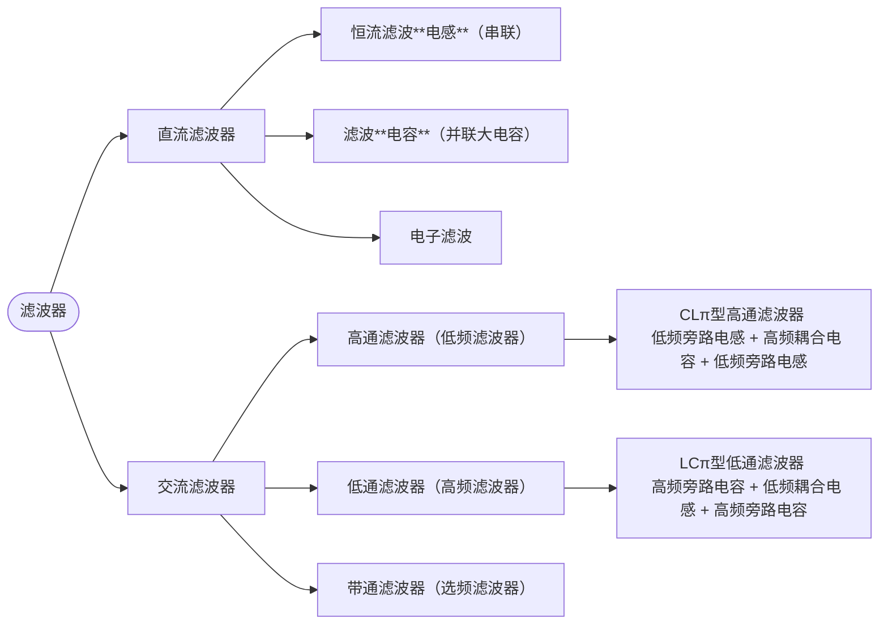

# 滤波器

```mermaid
flowchart LR
A([滤波器])

A-->B[直流滤波器]
A-->C[交流滤波器]

B-->D[恒流滤波**电感**（串联）]
B-->E[滤波**电容**（并联大电容）]
B-->F[电子滤波]

C-->G[高通滤波器（低频滤波器）]
C-->I[低通滤波器（高频滤波器）]
C-->K[带通滤波器（选频滤波器）]

G-->H[CLπ型高通滤波器 <br> 低频旁路电感 + 高频耦合电容 + 低频旁路电感 ]
I-->J[LCπ型低通滤波器 <br> 高频旁路电容 + 低频耦合电感 + 高频旁路电容 ]
```
